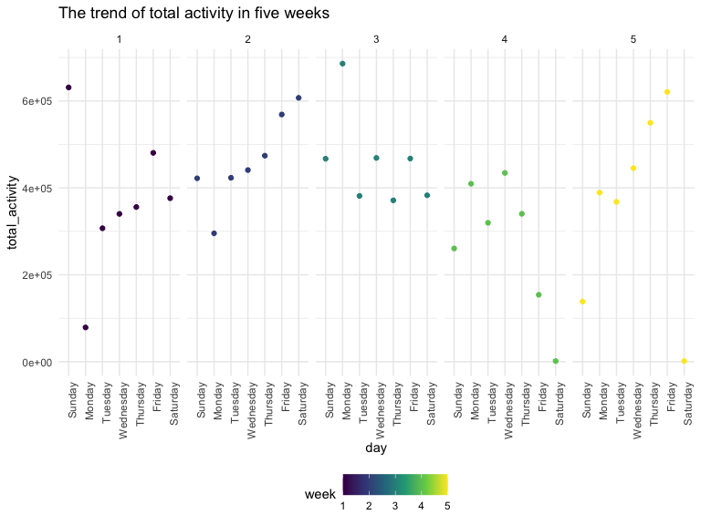

p8105_hw3_wy2369
================
Wenjing Yang

# Problem 1

### Load the dataset

Using this code chunk to load data from `p8105.datasets`.

``` r
data("instacart")

instacart = 
  instacart %>% 
  as_tibble(instacart)
```

### Write a short description of the dataset

This dataset contains **1384617** rows and **15** columns, with each row
resprenting a single product from an instacart order.

Variables include identifiers for user, order, and product; the order in
which each product was added to the cart. There are several order-level
variables, describing the day and time of the order, and number of days
since prior order. Then there are several item-specific variables,
describing the product name (e.g. Yogurt, Avocado), department
(e.g. dairy and eggs, produce), and aisle (e.g. yogurt, fresh fruits),
and whether the item has been ordered by this user in the past.

In total, there are **39123** products found in **131209** orders from
**131209** distinct users.

Below is a table summarizing the number of items ordered from aisle. In
total, there are **134** aisles, with fresh vegetables and fresh fruits
holding the most items ordered by far.

``` r
instacart %>% 
  count(aisle) %>% 
  arrange(desc(n))
```

    ## # A tibble: 134 × 2
    ##    aisle                              n
    ##    <chr>                          <int>
    ##  1 fresh vegetables              150609
    ##  2 fresh fruits                  150473
    ##  3 packaged vegetables fruits     78493
    ##  4 yogurt                         55240
    ##  5 packaged cheese                41699
    ##  6 water seltzer sparkling water  36617
    ##  7 milk                           32644
    ##  8 chips pretzels                 31269
    ##  9 soy lactosefree                26240
    ## 10 bread                          23635
    ## # … with 124 more rows

### Make a plot the number of items ordered in each aisle

The plot shows the number of items ordered in each aisle, which n is
more than 10000. Here, aisles are ordered by ascending number of items.

``` r
instacart %>% 
  count(aisle) %>% 
  filter(n > 10000) %>% 
  mutate(aisle = fct_reorder(aisle, n)) %>% 
  ggplot(aes(x = aisle, y = n)) + 
  geom_point() + 
  labs(title = "Number of items ordered in each aisle") +
  theme(axis.text.x = element_text(angle = 60, hjust = 1))
```


### Make a table showing the three most popular items

The three most popular items in aisles are
**`baking ingredients`**,**`dog food care`**, and
**`packaged vegetables fruits`**, and the table includes the number of
times each item is ordered.

``` r
instacart %>% 
  filter(aisle %in% c("baking ingredients", "dog food care", "packaged vegetables fruits")) %>%
  group_by(aisle) %>% 
  count(product_name) %>% 
  mutate(rank = min_rank(desc(n))) %>% 
  filter(rank < 4) %>% 
  arrange(desc(n)) %>%
  knitr::kable()
```

| aisle                      | product_name                                  |    n | rank |
|:---------------------------|:----------------------------------------------|-----:|-----:|
| packaged vegetables fruits | Organic Baby Spinach                          | 9784 |    1 |
| packaged vegetables fruits | Organic Raspberries                           | 5546 |    2 |
| packaged vegetables fruits | Organic Blueberries                           | 4966 |    3 |
| baking ingredients         | Light Brown Sugar                             |  499 |    1 |
| baking ingredients         | Pure Baking Soda                              |  387 |    2 |
| baking ingredients         | Cane Sugar                                    |  336 |    3 |
| dog food care              | Snack Sticks Chicken & Rice Recipe Dog Treats |   30 |    1 |
| dog food care              | Organix Chicken & Brown Rice Recipe           |   28 |    2 |
| dog food care              | Small Dog Biscuits                            |   26 |    3 |

### Make a table showing the mean hour that Pink Lady Apples and Coffee Ice Cream are ordered

Finally is a table showing the mean hour of the day at which Pink Lady
Apples and Coffee Ice Cream are ordered on each day of the week. This
table has been formatted in an untidy manner for human readers.

Pink Lady Apples are generally purchased slightly earlier in the day
than Coffee Ice Cream, with the exception of day 5.

``` r
instacart %>%
  filter(product_name %in% c("Pink Lady Apples", "Coffee Ice Cream")) %>%
  group_by(product_name, order_dow) %>%
  summarize(mean_hour = mean(order_hour_of_day)) %>%
  spread(key = order_dow, value = mean_hour) %>%
  knitr::kable(digits = 2)
```

| product_name     |     0 |     1 |     2 |     3 |     4 |     5 |     6 |
|:-----------------|------:|------:|------:|------:|------:|------:|------:|
| Coffee Ice Cream | 13.77 | 14.32 | 15.38 | 15.32 | 15.22 | 12.26 | 13.83 |
| Pink Lady Apples | 13.44 | 11.36 | 11.70 | 14.25 | 11.55 | 12.78 | 11.94 |

# Problem 2

### Load, tidy, and wrangle the data

The dataset includes all originally observed variables and values. It
includes a weekday vs weekend variable (day_type) and encodes data with
reasonable variable classes.

``` r
accel_df = 
  read_csv("./data/accel_data.csv") %>%
  janitor::clean_names() %>%
  mutate(
    day_type = if_else(day %in% c("Sunday","Saturday"),"weekend","weekday")) %>%
  pivot_longer(
    activity_1:activity_1440,
    names_to = "minute_interval",
    names_prefix = "activity_",
    values_to = "activity_count")%>%
    mutate(
      day = fct_relevel(day,c("Sunday","Monday","Tuesday","Wednesday","Thursday","Friday","Saturday"))) %>%
  arrange(week,day)
```

    ## Rows: 35 Columns: 1443
    ## ── Column specification ────────────────────────────────────────────────────────
    ## Delimiter: ","
    ## chr    (1): day
    ## dbl (1442): week, day_id, activity.1, activity.2, activity.3, activity.4, ac...
    ## 
    ## ℹ Use `spec()` to retrieve the full column specification for this data.
    ## ℹ Specify the column types or set `show_col_types = FALSE` to quiet this message.

This resulting dataset contains **50400** rows and **6** columns. There
are 6 important variables which are **week**, **day_id**, **day**,
**day_type**, **minute_interval**, and **activity_count**.

From the dataset, I arrange the order of variable **day** to make sure
people can easily find activity counts at certain day and certain time,
which collected on a 63 year-old male with BMI 25.

### Analyse the data and create a table

Create a total activity variable for each day, and make a table showing
these totals.

``` r
accel_total_activity = 
  accel_df %>%
  group_by(week,day) %>%
  summarize(total_activity = sum(activity_count))

accel_total_tidy =
  accel_total_activity %>%
  pivot_wider(
    names_from = day,
    values_from = total_activity)%>%
  knitr::kable()

accel_total_tidy
```

| week | Sunday |    Monday |  Tuesday | Wednesday | Thursday |   Friday | Saturday |
|-----:|-------:|----------:|---------:|----------:|---------:|---------:|---------:|
|    1 | 631105 |  78828.07 | 307094.2 |    340115 | 355923.6 | 480542.6 |   376254 |
|    2 | 422018 | 295431.00 | 423245.0 |    440962 | 474048.0 | 568839.0 |   607175 |
|    3 | 467052 | 685910.00 | 381507.0 |    468869 | 371230.0 | 467420.0 |   382928 |
|    4 | 260617 | 409450.00 | 319568.0 |    434460 | 340291.0 | 154049.0 |     1440 |
|    5 | 138421 | 389080.00 | 367824.0 |    445366 | 549658.0 | 620860.0 |     1440 |

To find out the trend of these data, I also make a plot using the code
chunk below.

``` r
accel_total_activity %>%
  ggplot(aes(x= day, y = total_activity ,color= week)) +
  geom_point()+
  facet_grid(.~week) +
  labs(
    title = "The trend of total activity in five weeks")+
  theme(axis.text.x = element_text(angle = 90, hjust = 1))
```



From this plot, I think there is no obvious trend of total activity
counts for each day. The highest total activity counts was collected on
Monday of week 3, and the lowest was collected on Saturday of week 4 and
week 5.

### Make a single-panel plot that shows the 24-hour activity

Using this code chunk to make a plot which presents the 24-hour activity
time courses for each day.

``` r
accel_df %>%
  mutate(minute_interval = as.numeric(minute_interval))%>%
  ggplot(aes(x = minute_interval,y = activity_count, color = day, group = week))+
  geom_point()+
  labs(
    title = "24-hour activity count for each day",
    x = "time",
    y = "activity_count",
    caption = "Data from accel_data.csv"
  )+
  geom_line()+
    scale_x_continuous(
    breaks = c(180,360,540,720,900,1080,1260,1440),
    labels = c("3:00","6:00","9:00","12:00","15:00","18:00","21:00","24:00")
  )
```


Based on the resulting plot, the activity counts are always lower than
2500 from 22:00 to 5:00 for each day. However, activity counts increase
at around 6:00, 9:00, 11:00, 16:00 and 20:00. From 20:00 to 22:00, most
activity counts are higher than 5000 and the highest point is 8982.

# Problem 3

### Load the data

``` r
data("ny_noaa")
ny_noaa = 
  ny_noaa %>% 
  as_tibble(ny_noaa)
```

### Clean data and create separate variables

Clean data first, and create separate variables for **year**, **month**,
and **day**. Using the code chunk below to convert variables **prcp**,
**snow**, **snwd**, **tmax** and **tmin** into numeric variables.

``` r
ny_noaa_df = 
  ny_noaa %>%
  janitor::clean_names() %>%
  separate(date, into = c("year","month","day") ) %>%
  mutate(
    year = as.numeric(year),
    prcp = as.numeric(prcp)/10,
    snow = as.numeric(snow),
    snwd = as.numeric(snwd),
    tmax = as.numeric(tmax)/10,
    tmin = as.numeric(tmin)/10) 
```

Now there are **2595176** rows and **9** columns in the `ny_noaa_df`
dataset. Variables are **9** which include id, year, month, day,
prcp(tenths of mm), snow(mm), snwd(mm), tmax(tenths of degrees C), and
tmin(tenths of degrees C).

### Find the most commonly observed value for snowfall

``` r
ny_noaa_df %>%
  group_by(snow)%>%
  summarize(snow_obs = n())%>%
  arrange(desc(snow_obs))
```

    ## # A tibble: 282 × 2
    ##     snow snow_obs
    ##    <dbl>    <int>
    ##  1     0  2008508
    ##  2    NA   381221
    ##  3    25    31022
    ##  4    13    23095
    ##  5    51    18274
    ##  6    76    10173
    ##  7     8     9962
    ##  8     5     9748
    ##  9    38     9197
    ## 10     3     8790
    ## # … with 272 more rows

For snowfall, the most commonly observed value is **0** which means for
most day it is not snowing in NYC.

### Make a two-panel plot showing the average max temperature in January and July

Using this code chunk to filter the maximum temperature in January and
July, and then calculate the mean values using `summarize()`. After
that, I set **year** as x axis and **mean_tmax** as y axis to make a
two-panel plot.

``` r
ny_noaa_df%>%
  filter(month %in% c("01", "07")) %>%
  group_by(id, year, month) %>%
  drop_na(tmax) %>%
  summarize(mean_tmax = mean(tmax,na.rm = TRUE) ) %>%
  ggplot(aes(x = year,y = mean_tmax, color = month)) +
  geom_point()+
  labs(
    title = "The plot of average max temperature in January and July in each station across years",
    x = "year",
    y = "mean_tmax",
    caption = "Data from p8105. datasets") +
  facet_grid(.~month)
```


From the two-panel plot, the average max temperature in January are much
lower than the average max temperature in July. The range of mean tmax
in January is about (-10 \~ 10), but there are some outlines which are
lower than -15 or higher than 10. The range of mean tmax in July is
about (20 \~ 35), and there are also some outlines lower than 20.

### Make a two-panel plot showing (i) and (ii)

This plot shows (i) tmax vs tmin for the full dataset and (ii) make a
plot showing the distribution of snowfall values greater than 0 and less
than 100 separately by year.

``` r
plot_i =
  ny_noaa_df %>%
    drop_na(tmax,tmin) %>%
    ggplot(aes(x = tmax, y = tmin)) +
    geom_hex() +
    labs(
      x = "maximum temperature (degrees C)",
      y = "minimum temperature (degrees C)",
      title = "maximum temperature vs minimum temperature aross years",
      caption = "Data from p8105. datasets") +
  theme(plot.title = element_text(size = 10),text = element_text(size = 6))

plot_ii = 
  ny_noaa_df %>%
  filter(snow>0, snow <100) %>%
  group_by(year) %>%
  ggplot(aes(x = snow, y = year, group = year, fill = year)) +
  geom_density_ridges(alpha =.8) +
   labs(
      x = "snowfall (mm)",
      y = "year",
      title = "the distribution of snowfall values from 1980 to 2010",
      caption = "Data from p8105. datasets") +
    theme(plot.title = element_text(size = 10),text = element_text(size = 6))

plot_i+plot_ii
```

    ## Picking joint bandwidth of 3.76


I use `geom_hex()` code to plot that maximum temperature vs minimum
temperature as `plot_i`, and use `geom_density_ridges()` code to show
the distribution of snowfall values which are between 0mm to 100mm
separately by year.
